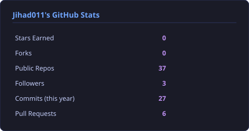
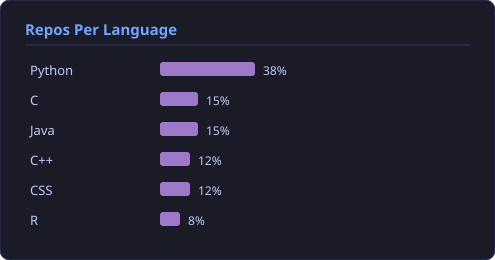
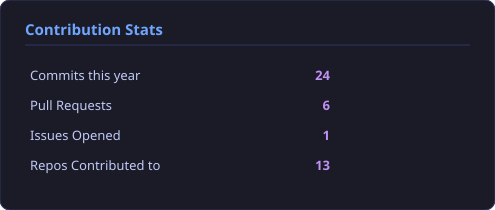
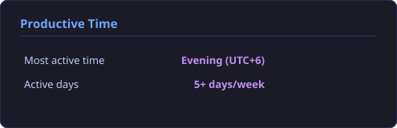

<div align="center">
  
</div>

<p align="center">
  
</p>

<h3 align="center">
  
</h3>

<div align="center">
  
  
  
</div>

<br>

---

##  <span style="color:#00D9FF">**About Me**</span>

<table align="center">
<tr>
<td>

```yaml
Name: Md. Jihad Hossain
Education: B.Sc. in Software Engineering
Institution: University of Dhaka (IIT)
Location: Dhaka, Bangladesh 🇧🇩
Role: Full Stack Developer & ML Enthusiast

Technical Interests:
  - Artificial Intelligence & Machine Learning
  - Full Stack Web Development
  - DevOps & Cloud Architecture
  - Quantum Computing & Algorithms

Intellectual Pursuits:
  - 🌌 Cosmology & Astronomy: Understanding the universe's mysteries
  - ⚛️ Quantum Mechanics: Exploring the fundamental nature of reality
  - 📚 Literature: Classic and contemporary works that shape thought
  - 🏛️ History: Learning from humanity's triumphs and failures
  - 💹 Economics: Understanding systems that drive civilizations
  - 🧠 Philosophy: Questions of existence, logic, and meaning

Motto: "At the intersection of code and cosmos, logic and literature"
Status: Open to collaboration, deep conversations, and opportunities
```

</td>
</tr>
</table>

### <span style="color:#FFD700">🎯 Current Focus</span>


- 🔭 **Building**: Full-stack applications with Python, JavaScript, and modern frameworks
- 🌱 **Learning**: Machine learning fundamentals, system design, and scalable architectures
- 👯 **Exploring**: The intersection of technology and science — AI, quantum computing, data science
- 📚 **Reading**: 
  - *Technical*: Clean Code, System Design, ML papers
  - *Cosmology*: Works on black holes, relativity, and the fabric of spacetime
  - *Literature*: Philosophy, history, and economic theory
  - *Current*: Books on quantum mechanics and computational complexity
- 🌌 **Fascinated by**: How the universe works at both cosmic and quantum scales
- 🎓 **Goal**: Building impactful solutions while continuously expanding knowledge across disciplines

---

##  <span style="color:#FF6B6B">**Technology Stack**</span>


### <span style="color:#61DAFB">💻 Programming Languages</span>

<p align="center">
  
  
  
  
  
  
  
</p>

### <span style="color:#FFD43B">⚡ Frameworks & Libraries</span>

<p align="center">
  
  
  
  
  
  
  
  
</p>

### <span style="color:#47A248">🗄️ Databases & Cloud</span>

<p align="center">
  
  
  
  
  
  
</p>

### <span style="color:#2496ED">🔧 DevOps & Tools</span>

<p align="center">
  
  
  
  
  
  
  
</p>

### <span style="color:#FF6F00">🤖 AI/ML & Data Science</span>

<p align="center">
  
  
  
  
  
  
  
</p>

---

##  <span style="color:#00D9FF">**GitHub Analytics**</span>


<p align="center">
  
</p>

<p align="center">
  
</p>

---

##  <span style="color:#9B59B6">**Digital Portfolio**</span>

<div align="center">

### <span style="color:#FF6B6B">✨</span> <span style="color:#4ECDC4">**Explore My Interactive Portfolio**</span> <span style="color:#FFD93D">✨</span>

<a href="https://jihad011.github.io/My-Portfolio/">
  
</a>

<br><br>

<table>
<tr>
<td align="center" width="100%">

### 🎨 **[jihad011.github.io/My-Portfolio](https://jihad011.github.io/My-Portfolio/)**

<a href="https://jihad011.github.io/My-Portfolio/">
  
</a>

<br><br>

*A carefully crafted digital space where code meets creativity*

<br>

**Featured Elements:**

🎯 **Interactive Design** • 💼 **Project Showcases** • 📱 **Responsive Layout**  
⚡ **Smooth Animations** • 🎨 **Modern UI/UX** • 📊 **Skills Visualization**

<br>

```css
.portfolio {
  design: "Elegant & Minimalist";
  technology: ["HTML5", "CSS3", "JavaScript"];
  features: ["Responsive", "Fast", "Accessible"];
  purpose: "Showcasing journey and capabilities";
}
```

<br>

*"A developer's portfolio is not just a resume—it's a reflection of their journey,  
their craft, and their vision for what technology can achieve."*

<br>

<a href="https://jihad011.github.io/My-Portfolio/">
  
  
  
</a>

</td>
</tr>
</table>

</div>

---

##  <span style="color:#FF6B6B">**Featured Projects & Innovations**</span>


<div align="center">

### <span style="color:#FFD700">💫 Showcasing Innovation Through Code</span>

*<span style="color:#00D9FF">"Every project is a journey from </span><span style="color:#FF6B6B">idea</span><span style="color:#00D9FF"> to </span><span style="color:#4ECDC4">impact</span><span style="color:#00D9FF">, from </span><span style="color:#9B59B6">vision</span><span style="color:#00D9FF"> to </span><span style="color:#FFD93D">reality</span><span style="color:#00D9FF">."</span>*

</div>

<br>

### <span style="color:#00C853">🎯 Live & Deployed</span>

<table>
<tr>
<td width="50%" valign="top">

#### 🏋️ **[Abs Calculator](https://github.com/Jihad011/Abs-Calculator)** 

**Transform Your Fitness Journey with Data-Driven Insights**

A sophisticated web application that revolutionizes fitness planning by providing personalized timeline predictions for achieving visible abs. Using advanced algorithms and metabolic calculations, it considers individual body composition, dietary habits, and exercise patterns.

**🎯 Key Features:**
- 📊 Personalized body composition analysis
- 📅 Timeline predictions based on real metabolic data
- 🔥 Calorie deficit calculations
- 💪 Exercise recommendation system
- 📈 Progress tracking visualization

**💻 Tech Stack:**
```
Python • Flask • JavaScript • HTML5 • CSS3
```

**🌟 Impact:** Helping individuals make informed fitness decisions with science-backed predictions

<p align="center">
<a href="https://github.com/Jihad011/Abs-Calculator">

</a>
</p>

</td>
<td width="50%" valign="top">


**📊 Project Highlights:**

```yaml
Type: Full Stack Web Application
Status: ✅ Live & Production Ready
Users: Growing community of fitness enthusiasts
Purpose: Making fitness goals achievable
Approach: Data-driven, science-backed
```

**🔗 Quick Links:**
- [📱 Live Demo](#)
- [📖 Documentation](https://github.com/Jihad011/Abs-Calculator)
- [⭐ Star on GitHub](https://github.com/Jihad011/Abs-Calculator)

</td>
</tr>
</table>

---

### <span style="color:#9B59B6">🌟 Future Innovations</span>

<div align="center">

<table>
<tr>
<td width="50%" align="center">

#### 🚀 **TaskFlow Pro**
*Collaborative Project Management Reimagined*


Real-time collaboration platform designed for modern teams, featuring intelligent task management, visual workflows, and predictive analytics.

**🎯 Vision:**
- 📋 Intelligent Kanban Boards
- 👥 Real-time Team Collaboration
- 📊 Predictive Analytics
- 🔔 Smart Notifications
- 📈 Performance Insights

`MERN Stack` • `Socket.io` • `Redux` • `MongoDB`

</td>
<td width="50%" align="center">

#### 🧠 **AI Study Companion**
*Personalized Learning with AI*


An AI-powered educational assistant that adapts to individual learning styles, providing personalized study plans, explanations, and practice problems.

**🎓 Features:**
- 🤖 Adaptive Learning Algorithms
- 📚 Personalized Study Plans
- 💡 Interactive Problem Solving
- 📊 Progress Analytics
- 🎯 Spaced Repetition System

`Python` • `PyTorch` • `NLP` • `React` • `FastAPI`

</td>
</tr>
</table>

</div>

---

<div align="center">

### <span style="color:#4ECDC4">💭 Development Philosophy</span>

<table>
<tr>
<td align="center">

**🎯 User-Centric**  
*Every line of code serves a purpose*  
Building solutions that matter

</td>
<td align="center">

**⚡ Performance First**  
*Speed and efficiency matter*  
Optimized for real-world use

</td>
<td align="center">

**🔒 Security Always**  
*Trust is earned through code*  
Privacy and security by design

</td>
<td align="center">

**📈 Continuous Growth**  
*Learning never stops*  
Iterating towards perfection

</td>
</tr>
</table>

</div>

---

##  <span style="color:#FFD700">**Journey & Growth**</span>


<table align="center">
<tr>
<td align="center" width="33%">

### 🎓 Academic Foundation
**B.Sc. Software Engineering**  
University of Dhaka (IIT)

*Building theoretical knowledge*  
*into practical solutions*

</td>
<td align="center" width="33%">

### 💡 Learning Philosophy
**Continuous Evolution**  
Every line of code is a lesson

*From concepts to implementations*  
*From errors to insights*

</td>
<td align="center" width="33%">

### 🚀 Current Mission
**Growth Through Creation**  
Building projects that matter

*Quality over quantity*  
*Impact over numbers*

</td>
</tr>
</table>

<div align="center">

### <span style="color:#4ECDC4">🌱 Growth Milestones</span>

```yaml
📖 Education:
  • Pursuing B.Sc. in Software Engineering at IIT, University of Dhaka
  • Building strong foundation in algorithms, data structures, and system design
  • Exploring the intersection of mathematics, logic, and computation

💻 Development:
  • Created Abs-Calculator: Fitness application helping users track their health goals
  • Experimenting with full-stack technologies and modern development practices
  • Learning to write clean, maintainable, and scalable code

🧠 Technical Growth:
  • Deep diving into Machine Learning and AI applications
  • Exploring web development frameworks and best practices
  • Understanding software architecture and design patterns

🌐 Personal Philosophy:
  • "The journey of a thousand commits begins with a single line of code"
  • Embracing failures as stepping stones to mastery
  • Building not just software, but solutions to real-world problems
  • Inspired by giants: Gödel's logic, Hilbert's mathematics, Newton's physics
```

</div>

---

##  <span style="color:#FFD93D">**Core Competencies**</span>

<table align="center">
<tr>
<td align="center" width="50%">

### 🎨 Frontend Development
- Responsive & Accessible UI/UX
- Modern JavaScript (ES6+)
- React Ecosystem & State Management
- CSS Frameworks & Animations
- Progressive Web Apps (PWA)

</td>
<td align="center" width="50%">

### ⚙️ Backend Development
- RESTful & GraphQL APIs
- Database Design & Optimization
- Authentication & Authorization
- Microservices Architecture
- Server-Side Rendering

</td>
</tr>
<tr>
<td align="center" width="50%">

### 🤖 Machine Learning
- Supervised & Unsupervised Learning
- Neural Networks & Deep Learning
- Natural Language Processing
- Computer Vision
- Model Deployment & MLOps

</td>
<td align="center" width="50%">

### 🔧 Software Engineering
- Clean Code & Design Patterns
- Test-Driven Development (TDD)
- CI/CD Pipelines
- Agile & Scrum Methodologies
- System Design & Scalability

</td>
</tr>
</table>

---

##  <span style="color:#9B59B6">**Contribution Graph**</span>


<p align="center">
  
</p>

<p align="center">
  
  
</p>

<p align="center">
  
  
</p>

---

##  <span style="color:#FF6B6B">**Connect & Collaborate**</span>


<div align="center">

### <span style="color:#0077B5">💼 Professional Networks</span>

<a href="mailto:bsse1413@iit.du.ac.bd">
  
</a>
<a href="https://www.linkedin.com/in/md-jihad-hossain-247486253/">
  
</a>
<a href="https://github.com/Jihad011">
  
</a>
<a href="https://www.facebook.com/KurtGodel.DavidHilbert.IssacNewton.AlbertCamus.ji">
  
</a>

### 🌐 Online Presence

<a href="#">
  
</a>
<a href="#">
  
</a>
<a href="#">
  
</a>

</div>

<br>

<div align="center">

### 💡 I'm Open To

**🤝 Collaborations** • **💼 Full-Time Opportunities** • **🔬 Research Projects** • **🎯 Freelance Work** • **🎤 Speaking Engagements** • **✍️ Technical Writing**

</div>

---

##  <span style="color:#4ECDC4">**Professional Philosophy**</span>

<div align="center">

```javascript
const jihadHossain = {
    code: ["JavaScript", "Python", "C++", "SQL"],
    technologies: {
        frontEnd: {
            js: ["React", "Next.js"],
            css: ["Tailwind", "Bootstrap", "Material-UI"]
        },
        backEnd:  {
            python: ["Django", "Flask", "FastAPI"],
            js: ["Node.js", "Express"]
        },
        databases: ["MongoDB", "MySQL", "PostgreSQL", "Redis"],
        devOps: ["Docker", "AWS", "Nginx", "CI/CD"],
        ai_ml: ["TensorFlow", "PyTorch", "Scikit-Learn", "NLP"]
    },
    architecture: ["Microservices", "Event-Driven", "Design Patterns"],
    currentFocus: "Building scalable AI-powered applications",
    funFact: "I debug with console.log and I'm not ashamed to admit it!  😄"
};
```

</div>

---

##  <span style="color:#FFD93D">**Words That Inspire**</span>

<div align="center">
  
</div>

<div align="center">

### <span style="color:#FF6B6B">🌟 Guiding Principles</span>

*"We cannot solve our problems with the same thinking we used when we created them."* — Albert Einstein

*"The only way to do great work is to love what you do."* — Steve Jobs

*"In mathematics, you don't understand things. You just get used to them."* — John von Neumann

</div>

---

##  <span style="color:#9B59B6">**Animated Status**</span>

<div align="center">
  
</div>

---

##  <span style="color:#00D9FF">**Vision & Philosophy**</span>

<div align="center">

<table>
<tr>
<td align="center" width="50%">

### <span style="color:#4ECDC4">💭 On Learning</span>
*"In the realm of code,*  
*every error is a teacher,*  
*every bug is a puzzle,*  
*every solution is a discovery."*

**Embrace the unknown.**  
**Question everything.**  
**Build with purpose.**

</td>
<td align="center" width="50%">

### <span style="color:#FF6B6B">🎯 On Creation</span>
*"Software is not just*  
*about writing code,*  
*it's about solving problems,*  
*creating value,*  
*and making a difference."*

**Start small.**  
**Think big.**  
**Never stop growing.**

</td>
</tr>
<tr>
<td align="center" width="50%">

### <span style="color:#9B59B6">🌌 On the Universe</span>
*"From quantum fluctuations*  
*to cosmic expanses,*  
*the universe whispers secrets*  
*in the language of mathematics."*

**Explore the cosmos.**  
**Understand the quantum.**  
**Marvel at existence.**

</td>
<td align="center" width="50%">

### <span style="color:#FFD93D">📚 On Knowledge</span>
*"Books are time machines,*  
*history is our teacher,*  
*literature is our mirror,*  
*and wisdom transcends epochs."*

**Read deeply.**  
**Think critically.**  
**Learn perpetually.**

</td>
</tr>
</table>

<br>

### <span style="color:#00D9FF">🌟 Core Principles</span>

```diff
+ Curiosity: The fuel for continuous learning and exploration
+ Persistence: Every expert was once a beginner who never gave up
+ Creativity: Technology is a canvas; code is the art
+ Integrity: Write code as if the person maintaining it is a violent psychopath who knows where you live
+ Impact: Build tools that solve real problems for real people
+ Balance: Great code is not just functional—it's elegant, readable, and maintainable
```

### <span style="color:#FF6B6B">🔮 Future Aspirations</span>

<table align="center">
<tr>
<td width="33%" align="center">

🤖 **AI/ML Innovation**  
Developing intelligent systems  
that learn, adapt, and evolve

</td>
<td width="33%" align="center">

🌍 **Global Impact**  
Creating open-source tools  
that empower developers worldwide

</td>
<td width="33%" align="center">

🎓 **Knowledge Sharing**  
Mentoring future engineers  
and contributing to tech education

</td>
</tr>
</table>

</div>

---

##  <span style="color:#9B59B6">**Beyond Code:**</span> <span style="color:#00D9FF">Books & Intellectual Pursuits</span>

<div align="center">


### <span style="color:#FFD93D">🌟</span> *<span style="color:#FF6B6B">"I am what I </span><span style="color:#4ECDC4">read</span><span style="color:#FF6B6B">, and I </span><span style="color:#9B59B6">code</span><span style="color:#FF6B6B"> what I </span><span style="color:#FFD93D">imagine</span><span style="color:#FF6B6B">."</span>*

<br>

</div>

<table>
<tr>
<td width="50%" valign="top">

### <span style="color:#9B59B6">🌌 **Cosmology & Astronomy**</span>

*Exploring the vast canvas of space and time*

**Areas of Fascination:**
- 🌠 **Black Holes & Singularities**: Where physics breaks down
- 🌍 **Cosmic Evolution**: From Big Bang to heat death
- ⭐ **Stellar Physics**: Life cycles of stars
- 🔭 **Observational Astronomy**: The tools that reveal the universe
- 🌌 **Dark Matter & Energy**: The invisible 95% of reality

**Favorite Reads:**
```
📖 "A Brief History of Time" - Stephen Hawking
📖 "Cosmos" - Carl Sagan
📖 "The Elegant Universe" - Brian Greene
📖 "Astrophysics for People in a Hurry" - Neil deGrasse Tyson
```

*"We are a way for the cosmos to know itself." — Carl Sagan*

</td>
<td width="50%" valign="top">

### <span style="color:#00D9FF">⚛️ **Quantum Mechanics & Physics**</span>

*Diving into the counterintuitive realm of the very small*

**Areas of Study:**
- 🔬 **Quantum Superposition**: Being in multiple states at once
- 🎲 **Wave-Particle Duality**: The dual nature of reality
- 🔗 **Quantum Entanglement**: Spooky action at a distance
- 💻 **Quantum Computing**: The future of computation
- ⚡ **Fundamental Forces**: The rules that govern existence

**Essential Reading:**
```
📖 "QED: The Strange Theory of Light and Matter" - Feynman
📖 "The Quantum World" - J.C. Polkinghorne
📖 "Something Deeply Hidden" - Sean Carroll
📖 "Quantum Mechanics: The Theoretical Minimum" - Susskind
```

*"If you think you understand quantum mechanics, you don't." — Feynman*

</td>
</tr>
<tr>
<td width="50%" valign="top">

### <span style="color:#FF6B6B">📖 **Literature & Philosophy**</span>

*Where humanity's deepest questions meet artistic expression*

**Literary Interests:**
- 🎭 **Classic Literature**: Timeless narratives of the human condition
- 🧠 **Philosophy**: Existentialism, logic, epistemology, ethics
- ✍️ **Essays & Criticism**: Ideas that challenge perspectives
- 🎨 **Poetry**: The mathematics of language
- 💭 **Thought Experiments**: Philosophical puzzles

**Influential Works:**
```
📖 Dostoyevsky, Camus, Kafka, Borges
📖 Russell, Gödel, Wittgenstein, Nietzsche
📖 Sagan, Asimov, Clarke, Huxley
📖 Works on logic, consciousness, and meaning
```

*"The unexamined life is not worth living." — Socrates*

</td>
<td width="50%" valign="top">

### <span style="color:#FFD93D">🏛️ **History & Economics**</span>

*Understanding civilization through time and systems*

**Historical Focus:**
- 🌍 **World History**: Rise and fall of civilizations
- 💡 **Scientific Revolutions**: Paradigm shifts in human understanding
- ⚔️ **Historical Turning Points**: Moments that changed everything
- 📜 **Philosophy of History**: Patterns and lessons
- 💹 **Economic Systems**: How societies organize resources

**Key Areas:**
```
📖 Economic Theory: Capitalism, socialism, game theory
📖 Behavioral Economics: Psychology meets economics
📖 History of Science: How we came to know what we know
📖 Industrial Revolutions: Technology reshaping society
```

*"Those who cannot remember the past are condemned to repeat it." — Santayana*

</td>
</tr>
</table>

<div align="center">

<br>

### <span style="color:#4ECDC4">🎯 **Why This Matters to My Code**</span>

<table>
<tr>
<td align="center" width="25%">

**🧠 Critical Thinking**  
Philosophy sharpens  
logical reasoning

</td>
<td align="center" width="25%">

**🔬 Scientific Method**  
Physics teaches  
systematic problem-solving

</td>
<td align="center" width="25%">

**🌍 Perspective**  
History provides  
context and wisdom

</td>
<td align="center" width="25%">

**📊 Systems Thinking**  
Economics reveals  
complex interactions

</td>
</tr>
</table>

<br>

*"The best programmers are not just coders—they are thinkers, readers, and perpetual learners  
who draw inspiration from the vast reservoir of human knowledge."*

</div>

---

##  <span style="color:#FFD700">**Support My Work**</span>

<div align="center">

If you find my projects helpful or interesting, consider: 

⭐ **Starring** my repositories  
🍴 **Forking** and contributing  
💬 **Sharing** with your network  
☕ **Buying me a coffee** (coming soon)

</div>

---

<div align="center">

### 🎯 "First, solve the problem. Then, write the code." – John Johnson


**Thanks for visiting!  Let's build something extraordinary together!  🚀**

<br>


</div>

<div align="center">
  
</div>

---

<div align="center">
  <sub>⚡ Powered by passion, fueled by coffee ☕ | Built with ❤️ by Md. Jihad Hossain</sub>
</div>
